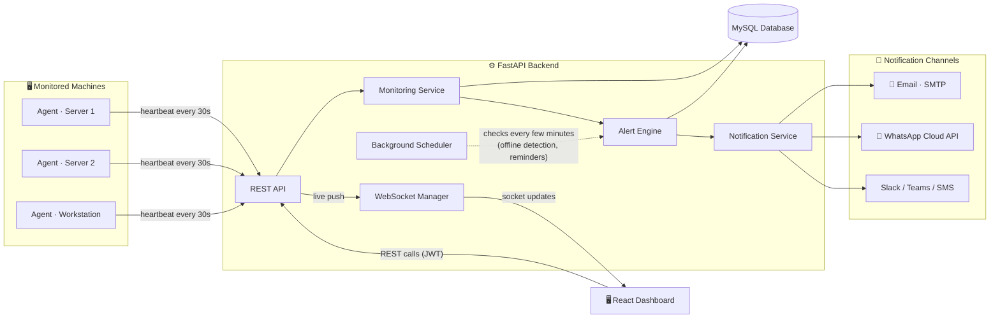
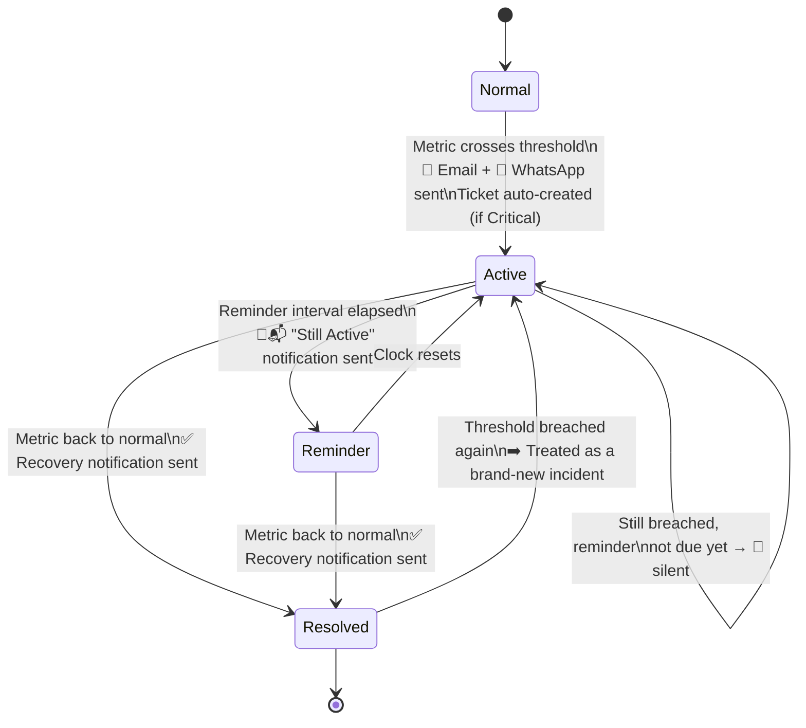

<div align="center">

# 🛰️ Enterprise AIOps Platform

**Real-time infrastructure monitoring, intelligent alerting, and asset management — built for teams who can't afford blind spots.**


</div>

---

## 📖 Table of Contents

1. [Overview](#-overview)
2. [How It All Fits Together](#-how-it-all-fits-together)
3. [Feature Tour](#-feature-tour)
4. [Enterprise Alert Lifecycle](#-enterprise-alert-lifecycle)
5. [Technology Stack](#-technology-stack)
6. [Project Structure](#-project-structure)
7. [Getting Started](#-getting-started)
8. [Environment Variables](#-environment-variables)
9. [API Documentation](#-api-documentation)
10. [Security Checklist](#-security-checklist)
11. [License](#-license)
12. [Author](#-author)

---

## 🧭 Overview

**Enterprise AIOps Platform** is a full-stack infrastructure monitoring and alerting system, similar in spirit to Datadog, Zabbix, or PRTG — but self-hosted and purpose-built for small-to-mid infrastructure teams.

A lightweight **Python agent** runs on every server, desktop, or workstation you want to watch. It reports live system metrics to a **FastAPI backend** every 30 seconds. The backend evaluates those metrics against thresholds, tracks the health of every asset, and — instead of spamming you every 30 seconds — sends **smart, deduplicated notifications** over **Email** and **WhatsApp** only when something actually changes.

A **React + TypeScript dashboard** ties it all together: one screen to see every asset's status, drill into live metrics, and manage the full incident lifecycle from detection to resolution.

> 💡 **In one sentence:** agents collect → backend decides → humans get notified only when it matters → dashboard shows everything live.

---

## 🏗️ How It All Fits Together



**The flow, in words:**

| Step | What happens |
|---|---|
| 1️⃣ | Each agent collects CPU, RAM, Disk, Network, hostname, IP, OS, uptime, etc. via `psutil` |
| 2️⃣ | Every **30 seconds**, the agent sends a heartbeat to the backend |
| 3️⃣ | The **Monitoring Service** stores the metrics and checks them against thresholds |
| 4️⃣ | The **Alert Engine** decides: is this a *new* problem, an *ongoing* one, or a *recovery*? |
| 5️⃣ | The **Notification Service** fires Email / WhatsApp — but only when the alert engine says so |
| 6️⃣ | The **Dashboard** shows live status via REST + WebSocket push, with zero manual refreshing |
| 7️⃣ | A **background scheduler** independently watches for silent/offline agents and overdue reminders |

---

## ✨ Feature Tour

<table>
<tr>
<td width="50%" valign="top">

### 🔐 Authentication
- JWT-based secure login
- Role-based user management
- Failed-login tracking with security alerts

### 🖥️ Asset Management
- Register / update / delete assets
- Auto-registration via agent identity (survives IP/MAC changes)
- Full hardware & network inventory
- QR-code asset tagging

### 📊 Monitoring
- CPU / RAM / Disk / Network usage
- System uptime, hostname, IP, OS
- Logged-in user & running process count
- Historical trends (1h / 24h / 7d)

</td>
<td width="50%" valign="top">

### 🧭 Unified Dashboard
- Total Assets · Online Assets · Open Alerts
- Asset picker with **live monitoring panel**
- Real-time charts (CPU / RAM / Disk / Network)
- Active alerts per asset, at a glance

### 🚨 Enterprise Alerting
- Threshold-based detection (Warning / Critical)
- No duplicate spam — one alert per incident
- Configurable reminder cadence
- Automatic recovery notifications
- Auto-created tickets for critical alerts

### 📣 Notifications
- Email (SMTP)
- WhatsApp (Meta Cloud API, Twilio, Gupshup, Interakt)
- Slack / Teams / SMS channels
- Per-user notification preferences

</td>
</tr>
</table>

### Also included
🎫 **Ticketing** (auto + manual) · 📈 **Reports & Analytics** (exportable) · 📝 **Audit Logs** · 🔔 **In-app notification bell** · 🔌 **Live WebSocket updates**

---

## 🔄 Enterprise Alert Lifecycle

This is the heart of the platform: metrics arrive every 30 seconds, but **notifications only fire when something meaningfully changes** — exactly the behavior you'd expect from Datadog, Nagios, or Zabbix.



**Why this matters:** without this state machine, an agent reporting every 30 seconds during a CPU spike would fire **hundreds of emails per hour**. Instead:

- 🟢 **First detection** → instant notification
- 🟡 **Still breached, no reminder due** → nothing sent (no spam!)
- 🟠 **Reminder interval elapsed** (configurable, e.g. every 6 hours) → one "still active" nudge
- ✅ **Back to normal** → one recovery notification, immediately
- 🔁 **Breaches again later** → treated as a fresh incident, notified immediately

The reminder cadence is fully configurable via an environment variable — no code changes needed to tune it per environment.

---

## 🧰 Technology Stack

<table>
<tr>
<th>Layer</th>
<th>Technologies</th>
</tr>
<tr>
<td><strong>Backend</strong></td>
<td>

`FastAPI` · `SQLAlchemy` · `Alembic` · `MySQL` · `JWT Authentication` · `WebSockets`

</td>
</tr>
<tr>
<td><strong>Frontend</strong></td>
<td>

`React` · `TypeScript` · `Vite` · `Tailwind CSS` · `React Query` · `Axios`

</td>
</tr>
<tr>
<td><strong>Monitoring Agent</strong></td>
<td>

`Python` · `psutil` · 30-second heartbeat loop with self-healing identity cache

</td>
</tr>
<tr>
<td><strong>Notifications</strong></td>
<td>

`SMTP Email` · `Meta WhatsApp Cloud API` (+ Twilio / Gupshup / Interakt) · `Slack` · `Teams` · `SMS`

</td>
</tr>
</table>

---

## 📁 Project Structure

```
AIOps-Platform/
│
├── AIOpa-agent/              🛰️ Lightweight monitoring agent
│   ├── main.py                  → heartbeat loop
│   ├── collector.py             → gathers CPU/RAM/Disk/Network via psutil
│   ├── sender.py                → registers + sends metrics to the backend
│   ├── identity.py              → caches agent UUID across restarts
│   └── config.py                → heartbeat interval, backend URL
│
├── backend/                  ⚙️ FastAPI application
│   ├── app/
│   │   ├── api/v1/
│   │   │   ├── auth/            → login, register, JWT
│   │   │   ├── assets/          → asset CRUD
│   │   │   ├── agents/          → agent registration & heartbeats
│   │   │   ├── monitoring/      → metrics + threshold engine
│   │   │   ├── alerts/          → alert lifecycle
│   │   │   ├── dashboard/       → summary + live monitoring endpoints
│   │   │   ├── notifications/   → notification preferences & history
│   │   │   ├── tickets/         → ticketing
│   │   │   ├── reports/         → analytics & exports
│   │   │   ├── audit/           → audit trail
│   │   │   └── qr/              → QR asset tagging
│   │   ├── services/            → email, WhatsApp, Slack/Teams/SMS senders
│   │   ├── models/               → SQLAlchemy models
│   │   ├── core/                 → config, security, scheduler
│   │   └── websocket/            → live dashboard push
│   └── alembic/                  → database migrations
│
└── frontend/                 🖥️ React + TypeScript dashboard
    └── src/
        ├── pages/                → Dashboard, Assets, Alerts, Tickets, Reports…
        ├── components/           → charts, tables, cards, layout
        ├── hooks/                → React Query hooks per resource
        └── services/ & api/      → typed Axios clients
```

---

## 🚀 Getting Started

### 1. Clone the repository
```bash
git clone https://github.com/YOUR_USERNAME/enterprise-aiops-platform.git
cd enterprise-aiops-platform
```

### 2. Backend setup
```bash
cd backend
python -m venv venv
```

Activate the virtual environment:

| OS | Command |
|---|---|
| Windows | `venv\Scripts\activate` |
| Linux / macOS | `source venv/bin/activate` |

Install dependencies and run:
```bash
pip install -r requirements.txt
uvicorn app.main:app --reload
```
The backend will be live at **http://localhost:8000**.

> ⚠️ On first run, a default `admin` account is seeded automatically so you always have a way in — check the printed console output for the generated credentials.

### 3. Frontend setup
```bash
cd frontend
npm install
npm run dev
```
The dashboard will be live at **http://localhost:5173**.

### 4. Start the monitoring agent
```bash
cd AIOpa-agent
pip install -r requirements.txt
python main.py
```
The agent auto-registers itself as a new asset and starts sending heartbeats every 30 seconds.

---

## 🔧 Environment Variables

Copy the example file and fill in your own values:
```bash
cp .env.example .env
```

Key variables you'll want to set:

| Variable | Purpose |
|---|---|
| `DB_HOST`, `DB_PORT`, `DB_NAME`, `DB_USER`, `DB_PASSWORD` | MySQL connection |
| `SECRET_KEY`, `ALGORITHM`, `ACCESS_TOKEN_EXPIRE_MINUTES` | JWT auth |
| `SMTP_HOST`, `SMTP_USERNAME`, `SMTP_PASSWORD` | Email notifications |
| `WHATSAPP_PROVIDER`, `WHATSAPP_TOKEN`, `WHATSAPP_PHONE_NUMBER_ID` | WhatsApp notifications |
| `ALERT_REMINDER_HOURS` | How often "still active" reminders are sent |
| `OFFLINE_THRESHOLD_MINUTES` | How long before a silent agent is marked offline |

---

## 📚 API Documentation

FastAPI generates interactive API docs automatically — no extra setup required:

```
http://localhost:8000/docs        ← Swagger UI
http://localhost:8000/redoc       ← ReDoc
```

---

## 🔒 Security Checklist

Never commit any of the following to version control:

- [ ] `.env` files
- [ ] API keys & tokens (WhatsApp, SMTP, Slack, Twilio…)
- [ ] Passwords
- [ ] Private keys / secrets
- [ ] Database credentials

Use `.env.example` as a template and keep real secrets out of Git history.

---

## 📄 License

Released under the **MIT License**.

---

## 👤 Author

Developed by **Deepanshu Bisht**

<div align="center">

*Built for teams who'd rather fix problems than get paged 200 times an hour.*

</div>
